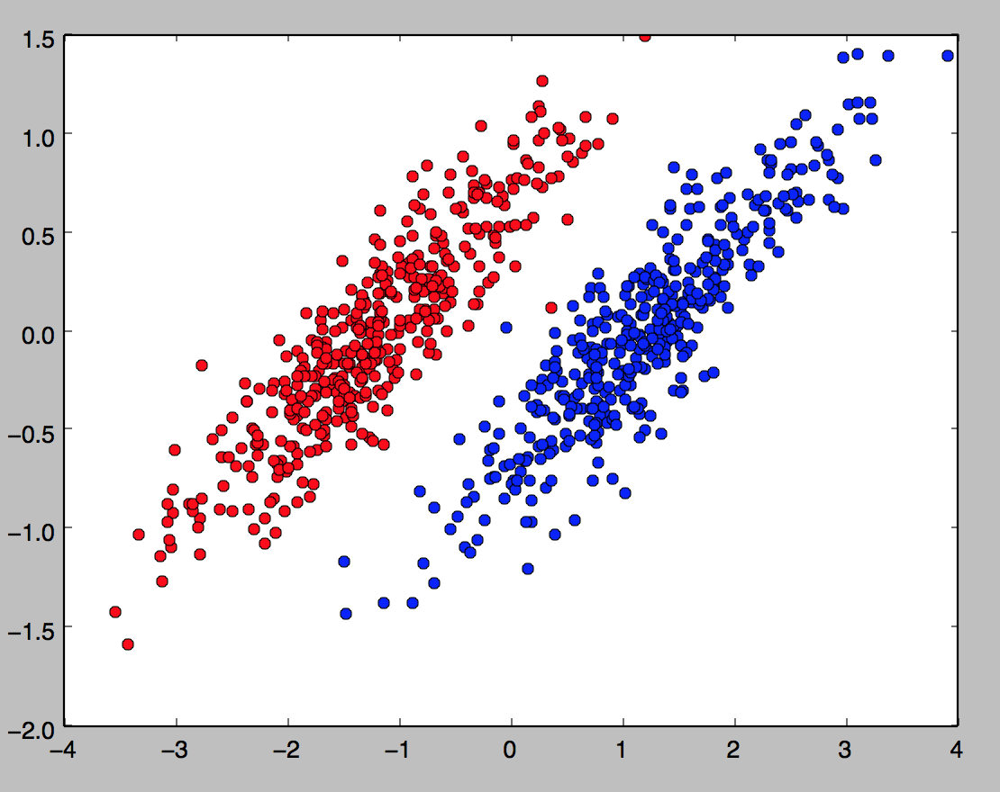
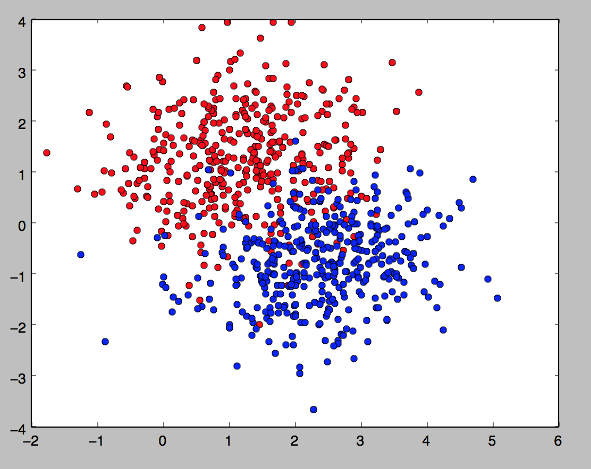
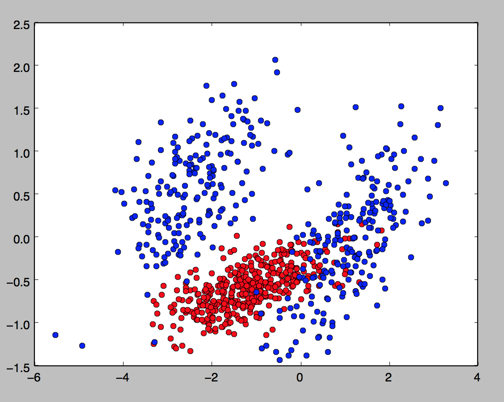

# SVM
Machine Learning Assignment 2

### Data Visualization

| Dataset        | Train           | Test  |
|:-------------:|:-----------------:|:-----:|
| A             |  |  |
| B             |  |  |
| C             |  |  |

--------

[Experiment result](https://goo.gl/I9PN5c)
